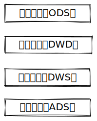

# 概述

数据仓库定义( Data Warehouse )， 是为企业所有决策制定过程，提供所有系统 数据支持的战略集合。

# 数仓分层

## 分层概念

- ODS 层
	- 原始数据层，存放原始数据，直接加载原始日志、数据，数据保持原貌不做处理。
- DWD 层  
	- 对ODS 层数据进行清洗(去除空值，脏数据，超过极限范围的数据)
- DWS 层
	- 以 DWD 为基础，进行轻度汇总。
- ADS 层 
	- 为各种统计报表提供数据

## 分层优点

- 把复杂问题简单化 
	- 将一个复杂的任务分解成多个步骤来完成，每一层只处理单一的步骤，比较简单、并且方便定位问题。
- 减少重复开发
	- 规范数据分层，通过的中间层数据，能够减少极大的重复计算，增加一次计算结果的复 用性。
- 隔离原始数据
	- 不论是数据的异常还是数据的敏感性，使真实数据与统计数据解耦开。

## 数仓命名规范

- ODS层命名为ods前缀
- DWD层命名为dwd前缀
- DWS层命名为dws前缀
- ADS层命名为ads前缀  
- 维度表命名为dim前缀  
- 每日全量导入命名为df(day full)后缀  
- 每日增量导入命名为di(day increase)后缀

# 业务数仓理论

## 表的分类

- 实体表
	- 实体表，一般是指一个现实存在的业务对象，比如用户，商品，商家，销售员等等。
- 维度表
	- 维度表，一般是指对应一些业务状态，编号的解释表。也可以称之为码表。 比如地区表，订单状态，支付方式，审批状态，商品分类等等。
- 事务性事实表
	- 事务型事实表，一般指随着业务发生不断产生的数据。特点是一旦发生不会再变化。一般比 如，交易流水，操作日志，出库入库记录等等。
- 周期型事实表
	- 周期型事实表，一般指随着业务发生不断产生的数据。  与事务型不同的是，数据会随着业务周期性的推进而变化。比如订单，其中订单状态会周期性变化。再比如，请假、贷款申请，随着批复状态在周 期性变化。

## 同步策略

- 实体表同步策略
	- 实体表数据量比较小:通常可以做每日全量，就是每天存一份完整数据。即每日全量。
- 维度表同步策略
	- 维度表数据量比较小:通常可以做每日全量，就是每天存一份完整数据。即每日全量。
- 事务型事实表同步策略
	- 因为数据不会变化，而且数据量巨大，所以每天只同步新增数据即可，所以可以做成每日增 量表，即每日创建一个分区存储。
- 周期型事实表同步策略
	- 这类表从数据量的角度，存每日全量的话，数据量太大，冗余也太大。如果用每日增量 的话无法反应数据变化。  每日新增及变化量，包括了当日的新增和修改。

# OneData

是阿里巴巴内部进行数据 整合及管理的方法体系和工具。

## 体系结构

## 规范定义

# 维度变化 

## 缓慢变化维

## 快照维表

## 微型维度