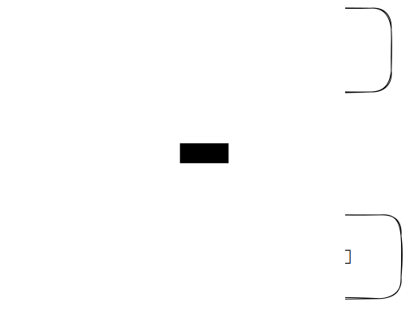

# 流程设计


# 业务表结构



# 数仓分层


# ODS 层

## 建表

[DDL语句](https://help.aliyun.com/document_detail/74236.html)

例子：ods_order

```sql
CREATE TABLE IF NOT EXISTS ods_order  
(  
  orderid                 STRING    
)  
COMMENT 'ods订单表'  
PARTITIONED BY  
(  
  dt                      STRING  
);
```

## 数据同步（数据导入）

将MySQL 中数据同步到 ODS 层对应的表。

参考：[数据集成](https://help.aliyun.com/document_detail/137478.html)

例子：[配置离线同步任务](https://help.aliyun.com/document_detail/137718.html?spm=a2c4g.11186623.0.0.9ca24f93FR1S8M)

# DWD层

## 建表

[DDL语句](https://help.aliyun.com/document_detail/74236.html)

例子：dwd_order

```sql
CREATE TABLE IF NOT EXISTS dwd_order  
(   
  orderid                 STRING   COMMENT '订单单号',  
)  
COMMENT 'dwd订单表'  
PARTITIONED BY  
(  
  dt                      STRING  
);
```


## 数据流转

参考：[DML操作](https://help.aliyun.com/document_detail/74250.html)

例子：dwd_order

```sql
INSERT OVERWRITE TABLE dwd_order partition(dt= '${bizdate}')  
  SELECT  oiod.orderid AS orderid
  FROM    order_order AS oiod 
  WHERE   oiod.dt = '${bizdate}'  
;
```

# DWS层

服务数据根据业务对[DWD层](#DWD层)进行轻度汇总，建表、数据流转参考[DWD层](#DWD层)。

# ADS层

应用数据根据业务对[DWS层](#DWS层)关联输出统计报表，建表、数据流转参考[DWD层](#DWD层)。

## 数据同步（数据导出）

将ODS 层对应的表数据同步到MySQL 中 。

参考：[数据集成](https://help.aliyun.com/document_detail/137478.html)

例子：[配置离线同步任务](https://help.aliyun.com/document_detail/137718.html?spm=a2c4g.11186623.0.0.9ca24f93FR1S8M)

# 作业调度

系统在约定的特定时刻去执行任务的过程。


参考：[作业调度](https://help.aliyun.com/document_detail/137545.html)

# 数据可视化

## QucikBI

参考：[官方文档](https://help.aliyun.com/product/30343.html)

例子：[分析数据](https://help.aliyun.com/document_detail/161417.html?spm=a2c4g.11186623.0.0.7a514666C3lGg3)

# 练习题

财务需求：
- 维度
	- 产品ID
	- 产品名称
	- 一级分类
	- 二级分类
	- 产品类型（standard_type = 1 = 标件，standard_type = 2 = 生鲜）
- 度量
	- 销售额（（销售金额 / 销售数量）* 出库数量）
		- 销售金额（orde_prcie - coupon - cut_price）
		- 出库数量 
		- 销售数量
	- 成本（出库数量 * 出库单价）
		- 出库数量
		- 出库单价
	- 毛利额（销售额 - 成本）